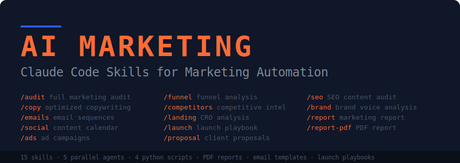

<p align="center">
  
</p>

# Suite de marketing con IA para Claude Code

Un sistema integral de análisis de marketing y automatización de habilidades para [Claude Code](https://docs.anthropic.com/en/docs/claude-code). Audita el marketing de cualquier sitio web, genera textos, crea secuencias de correo electrónico, elabora calendarios de contenido, analiza a la competencia y produce informes en PDF listos para el cliente, todo desde tu terminal.

**Diseñado para emprendedores, creadores de agencias y profesionales independientes que desean vender servicios de marketing impulsados ​​por IA.**
---
## ¿Qué hace esto?

Escribe un comando en Claude Code y obtén análisis de marketing instantáneos y prácticos:
```
> /market audit https://calendly.com

Lanzamiento de 5 agentes en paralelo..
✓ Content & Messaging Analysis     — Score: 72/100
✓ Conversion Optimization          — Score: 58/100
✓ SEO & Discoverability            — Score: 81/100
✓ Competitive Positioning          — Score: 64/100
✓ Brand & Trust                    — Score: 76/100
✓ Growth & Strategy                — Score: 61/100
Overall Marketing Score: 69/100

Informe completo guardado en MARKETING-AUDIT.md
```

---

## Instalación

### Instalación con un solo comando

```bash
curl -fsSL https://raw.githubusercontent.com/zubair-trabzada/ai-marketing-claude/main/install.sh | bash
```

### Instalación manual

```bash
git clone https://github.com/zubair-trabzada/ai-marketing-claude.git
cd ai-marketing-claude
./install.sh
```

### Optional: PDF Report Support

```bash
pip install reportlab
```

---

## Commands

| Command | What It Does |
|---------|-------------|
| `/market audit <url>` | Full marketing audit with 5 parallel agents |
| `/market quick <url>` | 60-second marketing snapshot |
| `/market copy <url>` | Generate optimized copy with before/after examples |
| `/market emails <topic>` | Generate complete email sequences |
| `/market social <topic>` | 30-day social media content calendar |
| `/market ads <url>` | Ad creative and copy for all platforms |
| `/market funnel <url>` | Sales funnel analysis and optimization |
| `/market competitors <url>` | Competitive intelligence report |
| `/market landing <url>` | Landing page CRO analysis |
| `/market launch <product>` | Product launch playbook |
| `/market proposal <client>` | Client proposal generator |
| `/market report <url>` | Full marketing report (Markdown) |
| `/market report-pdf <url>` | Professional marketing report (PDF) |
| `/market seo <url>` | SEO content audit |
| `/market brand <url>` | Brand voice analysis and guidelines |

---

## Architecture

```
ai-marketing-claude/
├── market/SKILL.md                     # Main orchestrator (routes all /market commands)
│
├── skills/                             # 14 sub-skills
│   ├── market-audit/SKILL.md           # Full audit orchestration
│   ├── market-copy/SKILL.md            # Copywriting analysis & generation
│   ├── market-emails/SKILL.md          # Email sequence generation
│   ├── market-social/SKILL.md          # Social media content calendar
│   ├── market-ads/SKILL.md             # Ad creative & copy
│   ├── market-funnel/SKILL.md          # Funnel analysis & optimization
│   ├── market-competitors/SKILL.md     # Competitive intelligence
│   ├── market-landing/SKILL.md         # Landing page CRO
│   ├── market-launch/SKILL.md          # Launch playbook generation
│   ├── market-proposal/SKILL.md        # Client proposal generator
│   ├── market-report/SKILL.md          # Marketing report (Markdown)
│   ├── market-report-pdf/SKILL.md      # Marketing report (PDF)
│   ├── market-seo/SKILL.md             # SEO content audit
│   └── market-brand/SKILL.md           # Brand voice analysis
│
├── agents/                             # 5 parallel subagents
│   ├── market-content.md               # Content & messaging analysis
│   ├── market-conversion.md            # CRO & funnel optimization
│   ├── market-competitive.md           # Competitive positioning
│   ├── market-technical.md             # Technical SEO & tracking
│   └── market-strategy.md              # Brand, pricing & growth strategy
│
├── scripts/                            # Python utility scripts
│   ├── analyze_page.py                 # Webpage marketing analysis
│   ├── competitor_scanner.py           # Competitor website scanner
│   ├── social_calendar.py              # Social content calendar generator
│   └── generate_pdf_report.py          # PDF report generator
│
├── templates/                          # Marketing templates
│   ├── email-welcome.md                # Welcome email sequence (5 emails)
│   ├── email-nurture.md                # Lead nurture sequence (6 emails)
│   ├── email-launch.md                 # Product launch sequence (8 emails)
│   ├── proposal-template.md            # Client proposal template
│   ├── content-calendar.md             # 30-day content calendar
│   └── launch-checklist.md             # Launch checklist
│
├── install.sh                          # One-command installer
├── uninstall.sh                        # Clean uninstaller
├── requirements.txt                    # Python dependencies
└── LICENSE                             # MIT License
```

---

## Scoring Methodology

La auditoría de marketing completa evalúa los sitios web en 6 dimensiones:

| Category | Weight | What It Measures |
|----------|--------|------------------|
| Content & Messaging | 25% | Copy quality, value props, headlines, CTAs |
| Conversion Optimization | 20% | Funnels, forms, social proof, friction, urgency |
| SEO & Discoverability | 20% | On-page SEO, technical SEO, content structure |
| Competitive Positioning | 15% | Differentiation, market awareness, alternatives |
| Brand & Trust | 10% | Design quality, trust signals, authority |
| Growth & Strategy | 10% | Pricing, acquisition channels, retention |

**Overall Marketing Score** = Promedio ponderado de todas las categorías (0-100)

---
## Cómo funciona

1. **You type a command** — e.g., `/market audit https://example.com`
2. **Claude reads the skill files** — they tell Claude exactly how to analyze the site
3. **5 subagents launch in parallel** — each one analyzes a different dimension
4. **Python scripts run** — automated page analysis, competitor scanning
5. **Results are compiled** — into a scored, prioritized, actionable report
6. **Output is saved** — as a Markdown file or professional PDF

---
## Casos de uso

### Para constructores de agencias
- Run `/market audit` on a prospect's website before a sales call
- Generate `/market proposal` with specific findings and pricing
- Deliver `/market report-pdf` as a professional client deliverable

### Para emprendedores individuales
- Use `/market copy` to optimize your own landing pages
- Generate `/market emails` for your product launches
- Build `/market social` calendars for consistent posting

### Para creadores de contenido
- Research competitors with `/market competitors`
- Plan launches with `/market launch`
- Analyze your funnel with `/market funnel`

---
## Desinstalar
```bash
./uninstall.sh
```

O manualmente:
```bash
rm -rf ~/.claude/skills/market*
rm -f ~/.claude/agents/market-*.md
```

---


## License

MIT License — see [LICENSE](LICENSE) for details.
